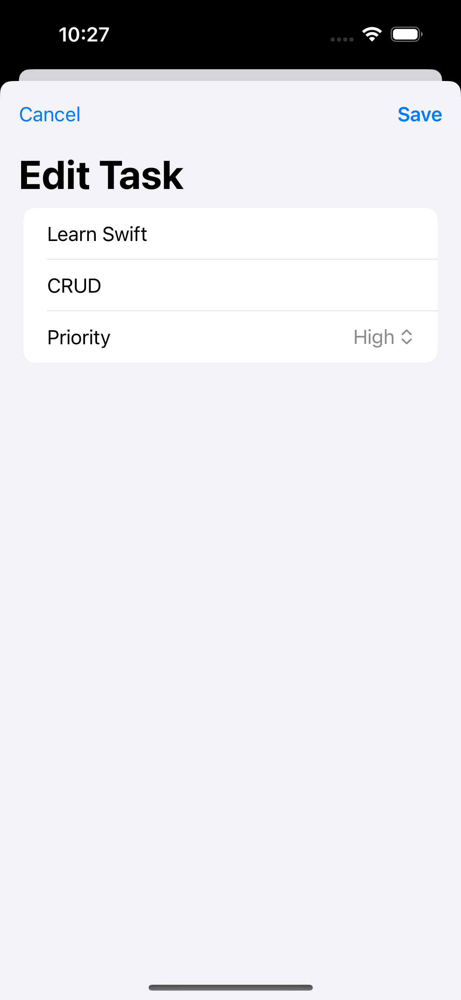

# To Do List App  

  

## Overview  

The To Do List app, developed with Swift and SwiftUI, provides an intuitive platform for organizing tasks efficiently. Designed with a simple, clean user interface, it allows users to easily add, edit, and manage tasks. The app ensures a seamless experience with persistent data storage, making task management reliable and straightforward.  
  
## Features  

- **Task Management:** Add, edit, and delete tasks with ease. Users can quickly mark tasks as complete or incomplete from the main list, offering a streamlined approach to tracking daily to-dos.
- **SwiftData Integration:** The app saves all task data automatically, ensuring that your tasks are retained even after the app is closed and reopened. This persistent storage guarantees that your task list is always up-to-date.
- **Swipe Actions** Quickly manage your tasks with swipe actions, allowing you to mark tasks as done or delete them without extra steps. This feature simplifies task management, making it faster and more interactive.
- **Dynamic Updates:** The app reacts to changes in real-time, updating the task list immediately when changes are made. This dynamic behavior ensures a smooth and responsive experience.  
